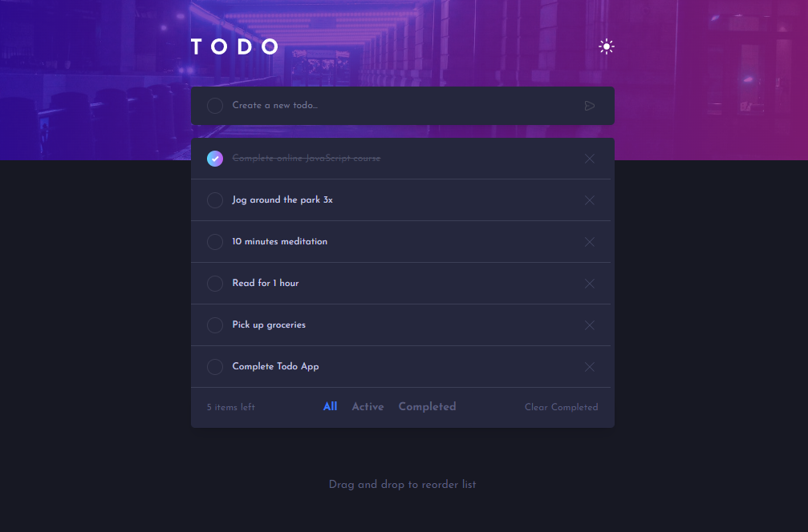

# Todo List UI


## Overview

Hello and thanks for visiting this project! 🎉

The mission behind this project was to build a fully-featured Todo List application, emphasizing both aesthetics and utility. The development journey was enhanced using a modern stack including TypeScript, Next.js, React.js, Tailwind CSS, Redux, and OAuth2 for authentication.

Feel free to view the live version of the project [here](https://github.com/oniasfilho/todo-api).



## Technologies Used

- **TypeScript**: Enriched JavaScript with type safety, paving the way for a smoother development experience and more predictable debugging.

- **Next.js**: Adopted for its server-side rendering capabilities, enhancing the application's SEO and overall performance.

- **React.js**: The cornerstone for crafting UI components in a modular and efficient manner.

- **Tailwind CSS**: Enabled swift UI development, all while working within the HTML.

- **Redux**: A predictable state container used to manage and update the application state efficiently.

- **OAuth2**: Leveraged Google's OAuth2 for secure and straightforward user authentication.

## Features Implemented

### Basic Todo Operations
- Add new todos to the list.
- Mark todos as complete.
- Delete todos from the list.

### Advanced Filtering
- Users can filter todos by their status: All, Active, or Complete.

### Dark Mode
- A nifty toggle allowing users to switch between light and dark themes.

### Responsiveness
- An adaptable UI ensuring an optimal layout on devices of all screen sizes, courtesy of Tailwind CSS.

### Interactivity
- All buttons and interactive elements have hover and focus states, fostering a superior UX.

### Bonus Features
- **Drag & Drop Functionality**: Allows users to reorder their todo items.

### Backend

The backend for this project is still under development. It utilizes Google's OAuth2 for authentication. You can check out its progress and delve into the code [here](https://github.com/oniasfilho/todo-api).

## Setup & Installation

1. Clone the repository:
    ```bash
    git clone https://github.com/oniasfilho/todo-ui
    ```

2. Change into the project directory:
    ```bash
    cd todo-ui
    ```

3. Install the required dependencies:
    ```bash
    npm install
    ```

4. Fire up the application:
    ```bash
    npm run dev
    ```

## Support

Should you have any questions or need assistance, don't hesitate to connect with me on LinkedIn: [Onias Filho](https://www.linkedin.com/in/oniasfilho). I'm always keen to help, especially when it comes to unraveling the intricacies of this project.

Huge thanks for exploring this challenge! Delve into the codebase if you're curious about the finer details of its implementation.
